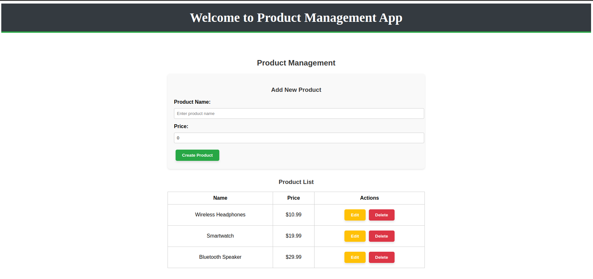

# ITI-dockerProject

## Overview

**ITI-dockerProject** is a 3-tier web application designed to demonstrate the use of Docker containers and images in modern web development. The project was developed as a practice exercise to gain hands-on experience with creating Docker images for both server-side and client-side applications, as well as orchestrating them using Docker Compose. It features a SQL Server database for persistent data storage, an ASP.NET Core Web API for handling server-side logic, and an Angular front-end interface. The application implements full CRUD (Create, Read, Update, Delete) operations on a "Product" entity, serving as a practical example of using Docker to containerize multi-tier applications.

## Technologies Used

- **ASP.NET Core 8.0**: For building the Web API.
- **Angular 18.2.7**: For the client-side application.
- **SQL Server 2022**: For data management.
- **Docker**: For containerizing the application components.
- **Docker Compose**: For orchestrating multi-container environments.
- **xUnit**: For unit testing the server-side logic.
- **Jasmine & Karma**: For unit testing the Angular application.

## User Interface Preview



## Installation Instructions

### Clone the Repository

To get started, clone the repository to your local machine using the following command:

```bash
git clone 
```

### Run the Project with Docker Compose

1. **Navigate to the Project Directory**:
   - Change to the directory containing the ClientSide and ServerSide projects where the `docker-compose.yml` file is located.

2. **Start the Application**:
   - Run the following command to build and start the application containers:
     ```bash
     docker compose up --build -d
     ```
   - After successful execution, access the application at `http://localhost:80`.

### Run the Project Using Local Setup (if you choose not to use Docker)

#### Prerequisites

Before running the application locally, ensure you have the following installed:

- **.NET SDK**: Version **8.0.402** or higher.
- **Node.js**: Version **v20.18.0** or higher.
- **Angular CLI**: Version **v18.2.7** or higher.
- **SQL Server**: Version **2022** or higher.

#### Modify the Connection String

When running the project locally, you need to update the database connection string in the `appsettings.Development.json` file, which is located in the `ServerSide/API` directory, to match your SQL Server login credentials.

1. Open the `appsettings.Development.json` file.
2. Modify the connection string in the `ConnectionStrings` section to reflect your SQL Server configuration. Example:

   For SQL Server with **SQL Server Authentication**:
   ```json
   "ConnectionStrings": {
     "DefaultConnection": "Server=YOUR_SERVER_NAME;Database=YOUR_DATABASE_NAME;User Id=YOUR_USERNAME;Password=YOUR_PASSWORD;TrustServerCertificate=True;"
   }
   ```

   For SQL Server using **Windows Authentication**, replace the connection string with:
   ```json
   "ConnectionStrings": {
     "DefaultConnection": "Server=YOUR_SERVER_NAME;Database=YOUR_DATABASE_NAME;Trusted_Connection=True;TrustServerCertificate=True;"
   }
   ```

#### Running the Application

1. **Run the Server-Side Project**:
   - Change to the ServerSide project directory and execute:
     ```bash
     dotnet run
     ```
   - This command builds and starts the server, creating the database and seeding it with initial data.

2. **Run the Client-Side Project**:
   - Change to the ClientSide project directory and execute:
     ```bash
     ng serve
     ```
   - The application will be accessible at `http://localhost:4200`.

#### Running Unit Tests

- For the ServerSide application, navigate to the solution directory and run:
  ```bash
  dotnet test
  ```
- For the Angular application, execute:
  ```bash
  ng test
  ```

## Usage

- **Access the Application**:
  - For local runs, visit `http://localhost:4200`.
  - For Docker Compose runs, visit `http://localhost:80`.

- **Application Features**:
  - The interface displays a header with the text **"Welcome to Product Management App."**
  - Two input fields allow users to enter the product name and price, followed by a **"Create Product"** button.
  - Upon clicking **"Create Product,"** a new product is added to the database.
  - A table below the button lists all available products, displaying their names, prices, and edit/delete buttons.
  - Clicking the **"Edit"** button populates the input fields with the selected product’s data, changing the button text to **"Update Product."** Pressing it updates the product.
  - The **"Delete"** button next to each product removes the respective product from the database.
  - Any changes made to the database are immediately reflected in the user interface.
